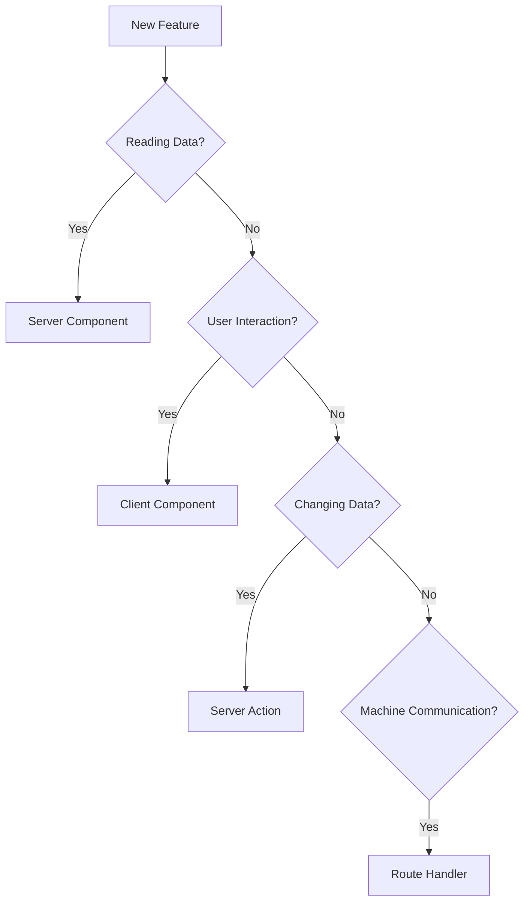
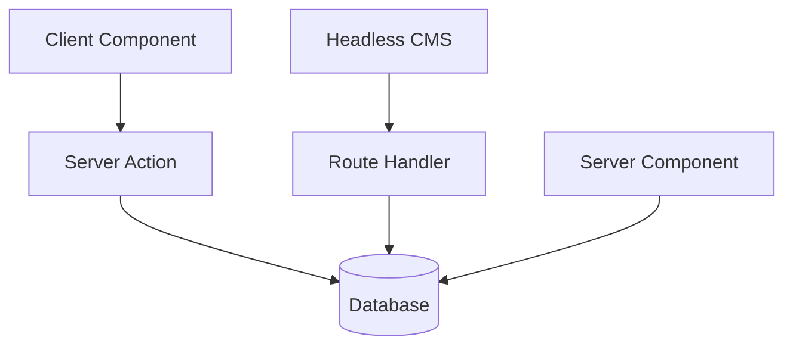
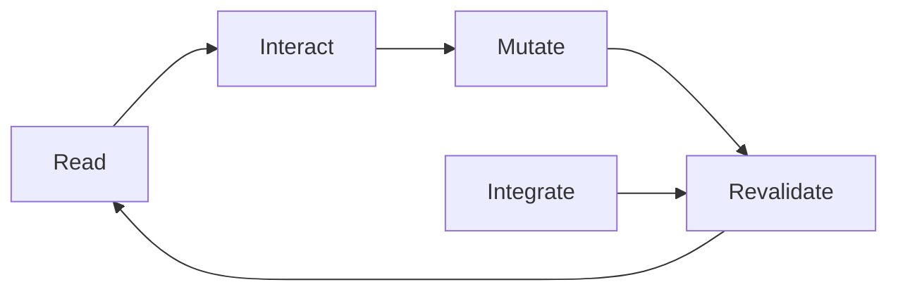
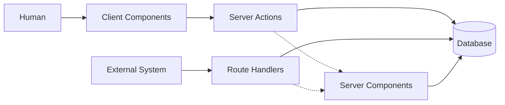

# Next.js 16 Architecture Series

# Part 7 — The Architect's Mental Model: How To Know Which Next.js Feature To Use

> **The biggest challenge in learning Next.js isn't understanding the features.**
>
> **It's knowing when to use them.**

By now, you've learned the four architectural pillars:

* **Server Components** read.
* **Client Components** interact.
* **Server Actions** mutate.
* **Route Handlers** communicate.

But when you're building a real application, you don't start with:

> "I need a Server Component."

Instead, you start with a problem:

> "I need to display a product."
>
> "I need to handle a button click."
>
> "I need to save an order."
>
> "I need to receive a Stripe webhook."

The real skill of a Next.js architect is learning to translate requirements into execution environments.

---

# The Biggest Mistake Beginners Make

Most developers initially think like this:

```text
Is this frontend?
       or
Is this backend?
```

This question made sense for traditional applications:

```text
Frontend
     ↓
REST API
     ↓
Backend
```

But Next.js applications aren't organized this way.

Instead, ask:

> **What responsibility does this code have?**

That single question determines where your code belongs.

---

# The Four Questions Framework

Whenever you're writing code, ask these four questions in order.



This decision tree solves most architectural decisions in Next.js.

---

# Question 1

## "Am I Reading Data?"

Examples:

* displaying products,
* rendering blog posts,
* fetching user profiles,
* reading inventory,
* showing dashboards,
* generating metadata.

If yes:

```text
Use Server Components
```

---

## Example

```tsx
export default async function Products() {
  const products =
    await db.product.findMany();

  return (
    <ul>
      {products.map(product => (
        <li key={product.id}>
          {product.name}
        </li>
      ))}
    </ul>
  );
}
```

Mental model:

```text
Database
     ↓
Server Component
     ↓
HTML
     ↓
Browser
```

---

# Question 2

## "Am I Responding To User Interaction?"

Examples:

* button clicks,
* forms,
* tabs,
* accordions,
* dropdowns,
* animations,
* drag-and-drop,
* search boxes.

If yes:

```text
Use Client Components
```

---

## Example

```tsx
'use client';

import { useState }
  from 'react';

export default function Counter() {

  const [count, setCount] =
    useState(0);

  return (
    <button
      onClick={() =>
        setCount(c => c + 1)
      }
    >
      {count}
    </button>
  );
}
```

Mental model:

```text
User
   ↓
Browser Event
   ↓
State Change
   ↓
UI Update
```

---

# Question 3

## "Am I Changing System State?"

Examples:

* create user,
* create order,
* update profile,
* delete comment,
* login,
* logout,
* checkout,
* payment processing.

If yes:

```text
Use Server Actions
```

---

## Example

```tsx
'use server';

export async function
createOrder() {

  await db.order.create();

  revalidatePath(
    '/orders'
  );
}
```

Mental model:

```text
User
   ↓
Server Action
   ↓
Business Logic
   ↓
Database
   ↓
Revalidation
```

---

# Question 4

## "Am I Talking To Another Machine?"

Examples:

* Stripe,
* GitHub,
* Slack,
* Shopify,
* mobile apps,
* webhooks,
* OAuth,
* external APIs.

If yes:

```text
Use Route Handlers
```

---

## Example

```tsx
export async function POST(
  request: Request
) {

  const body =
    await request.json();

  return Response.json({
    success: true,
  });
}
```

Mental model:

```text
External System
        ↓
HTTP
        ↓
Route Handler
        ↓
Application
```

---

# The Ultimate Cheat Sheet

| Question                       | Use               |
| ------------------------------ | ----------------- |
| Am I reading data?             | Server Components |
| Am I handling interaction?     | Client Components |
| Am I modifying data?           | Server Actions    |
| Am I communicating externally? | Route Handlers    |

---

# Example #1 — Blog Application

Suppose you're building a blog.

### Display posts?

```text
Server Component
```

### Like button?

```text
Client Component
```

### Create post?

```text
Server Action
```

### Receive CMS webhook?

```text
Route Handler
```



---

# Example #2 — E-Commerce Store

### Show products?

```text
Server Component
```

### Add to cart button?

```text
Client Component
```

### Checkout?

```text
Server Action
```

### Stripe webhook?

```text
Route Handler
```

---

# Example #3 — Authentication

### Render dashboard?

```text
Server Component
```

### Login form?

```text
Client Component
```

### Create session?

```text
Server Action
```

### Google OAuth callback?

```text
Route Handler
```

---

# Example #4 — File Upload

A common beginner question:

> "Should file uploads use Server Actions or Route Handlers?"

The answer is:

### User uploads file through your UI?

```text
Client Component
        ↓
Server Action
```

### External system uploads file?

```text
External System
        ↓
Route Handler
```

---

# The Golden Rule

When you're stuck, ask:

> **Who is initiating this operation?**

If it's:

| Initiator | Use                    |
| --------- | ---------------------- |
| Server    | Server Component       |
| Human     | Client + Server Action |
| Machine   | Route Handler          |

---

# The Architectural Flow

Ultimately, every Next.js application follows the same cycle:



This cycle is why Next.js applications feel synchronized.

---

# The One Diagram To Remember

If you forget everything else in this series, remember this diagram:



Everything in modern Next.js architecture can be explained by this picture.

---

# The Entire Series In One Sentence

After seven parts, we've arrived at the mental model that professional Next.js architects use:

> **Next.js applications are not frontend applications talking to backend applications.**
>
> **They are distributed applications executing specialized responsibilities in different environments.**

And those responsibilities can always be reduced to four simple ideas:

> **Server Components read.**
>
> **Client Components interact.**
>
> **Server Actions mutate.**
>
> **Route Handlers communicate.**

Once you understand that, Next.js stops feeling magical.

It starts feeling inevitable.

---

# Series Recap

| Part   | Topic                              |
| ------ | ---------------------------------- |
| Part 1 | Beyond Frontend vs Backend         |
| Part 2 | Server Components — The Reader     |
| Part 3 | Client Components — The Actor      |
| Part 4 | Server Actions — The Mutator       |
| Part 5 | Route Handlers — The Bridge        |
| Part 6 | How The Four Pillars Work Together |
| Part 7 | The Architect's Mental Model       |

> **Congratulations. You now understand the architectural foundation of modern Next.js applications.**
