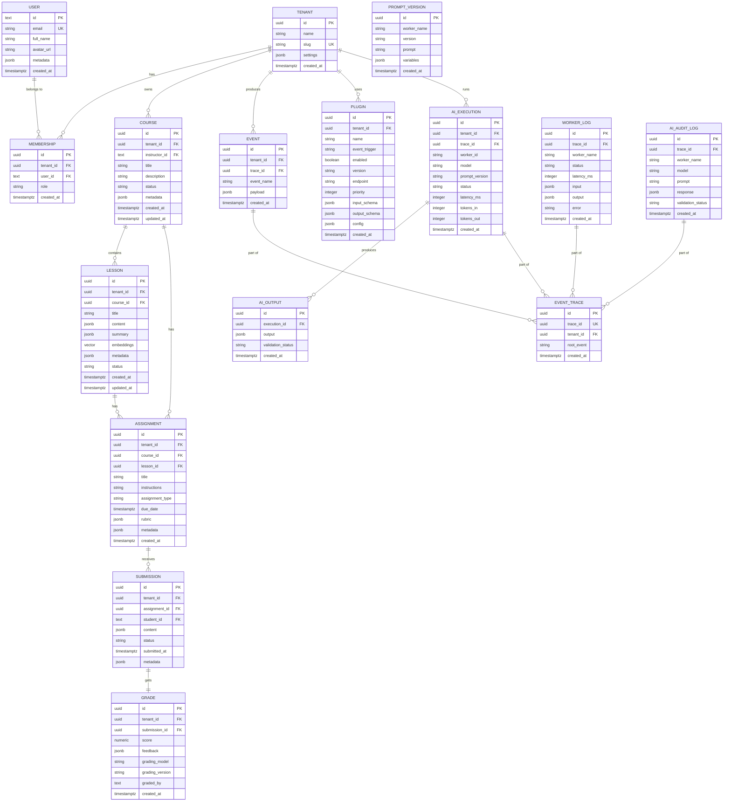

# Nexus LMS — Data Architecture & Data Model
**Version 1.1**  
**Last Updated:** June 2026  
**Status:** Draft → Refinement

## 1. Introduction

This document provides the **complete reference** for the Nexus LMS data architecture and data model. It serves as the single source of truth for engineers, AI developers, plugin authors, and database administrators.

### Core Goals
The data model is designed to:

- **Support true multi-tenancy** with strong isolation
- **Enable event-driven workflows** end-to-end
- **Be AI-native** — treating AI outputs, prompts, and executions as first-class data
- **Provide plugin extensibility** without code changes
- **Deliver full observability** and auditability
- **Support safe schema evolution** and replayability
- **Ensure replayable, traceable systems** for debugging and compliance

### Foundational Technologies & Patterns
- **PostgreSQL** (primary database)
- **Row Level Security (RLS)** for tenant isolation
- **Event Sourcing** + **CQRS-inspired** patterns
- **Immutable audit-first design**
- **JSONB** for flexible, versioned, and AI-friendly data
- **Temporal tables / versioning** where applicable

---

## 2. Data Architecture Principles

Nexus LMS follows **eight foundational principles**:

### Principle 1 — Multi-Tenant First
Every business entity includes a `tenant_id`. There is **no shared business data** across tenants.

### Principle 2 — Event-Driven Data
Every significant business action produces:
- A **current state record** (mutable when appropriate)
- An **immutable event** (append-only)

**Example:**
```
Assignment Submission
    ↓
Submission Record (current state) + assignment.submitted Event
```

### Principle 3 — Immutable Audit Trails
Events, AI executions, worker logs, and traces are **never updated or deleted** (only soft-deleted in extreme cases).

### Principle 4 — AI Outputs Are Data
AI-generated content is treated as durable, versioned, auditable assets stored in structured records.

### Principle 5 — Plugins Are Data
Plugins are configuration + metadata records, not code dependencies. They are discoverable and versioned.

### Principle 6 — Observability Is Data
All traces, logs, metrics, and AI interactions are permanently stored and queryable.

### Principle 7 — Schema Evolution Is Expected
All schemas support versioning, backward compatibility, and coexistence of multiple versions.

### Principle 8 — Everything Is Traceable
Every entity and execution includes:
- **Who** (actor)
- **What** (action)
- **When** (timestamp + trace_id)
- **Why** (context / trigger)
- **Where** (tenant, service, model)

---

## 3. High-Level Data Architecture

```
Business Data
├── Learning Domain
├── Identity Domain
├── Event Domain
├── Plugin Domain
├── AI Domain
└── Observability Domain
```

---

## 4. Database Domains

| Domain          | Purpose                              | Key Tables                     |
|-----------------|--------------------------------------|--------------------------------|
| **Identity**    | Tenants, users, access control       | `tenants`, `users`, `memberships`, `roles` |
| **Learning**    | Core educational content & progress  | `courses`, `lessons`, `assignments`, `submissions`, `grades`, `enrollments` |
| **Events**      | Event sourcing & workflows           | `events`, `event_replays`      |
| **Plugins**     | Extensibility & worker registry      | `plugins`, `plugin_versions`   |
| **AI**          | Executions, outputs, prompts         | `ai_executions`, `ai_outputs`, `prompt_versions` |
| **Observability**| Tracing, logging, auditing           | `event_traces`, `worker_logs`, `ai_audit_logs` |

---

## 5. Core Models

### 5.1 Tenant & Membership

```sql
tenants (
    id uuid PRIMARY KEY DEFAULT gen_random_uuid(),
    name text NOT NULL,
    slug text UNIQUE NOT NULL,
    settings jsonb DEFAULT '{}',
    created_at timestamptz DEFAULT now(),
    updated_at timestamptz DEFAULT now()
);

memberships (
    id uuid PRIMARY KEY DEFAULT gen_random_uuid(),
    tenant_id uuid NOT NULL REFERENCES tenants(id),
    user_id text NOT NULL,
    role text NOT NULL, -- owner, instructor, student, admin, etc.
    created_at timestamptz DEFAULT now()
);
```

### 5.2 User Model

```sql
users (
    id text PRIMARY KEY, -- usually sub from auth provider
    email text UNIQUE,
    full_name text,
    avatar_url text,
    metadata jsonb DEFAULT '{}',
    created_at timestamptz DEFAULT now()
);
```

### 5.3 Course Domain

```sql
courses (
    id uuid PRIMARY KEY DEFAULT gen_random_uuid(),
    tenant_id uuid NOT NULL,
    instructor_id text,
    title text NOT NULL,
    description text,
    status text DEFAULT 'draft', -- draft, published, archived
    metadata jsonb DEFAULT '{}',
    created_at timestamptz DEFAULT now(),
    updated_at timestamptz DEFAULT now()
);
```

**Relationships**: Courses → Lessons, Assignments, Enrollments

### 5.4 Lesson Domain

```sql
lessons (
    id uuid PRIMARY KEY DEFAULT gen_random_uuid(),
    tenant_id uuid NOT NULL,
    course_id uuid NOT NULL REFERENCES courses(id),
    title text NOT NULL,
    content jsonb,           -- rich content (blocks, markdown, etc.)
    summary jsonb,           -- AI-generated
    embeddings vector(1536), -- for semantic search
    metadata jsonb DEFAULT '{}',
    status text DEFAULT 'draft',
    created_at timestamptz DEFAULT now(),
    updated_at timestamptz DEFAULT now()
);
```

**AI Artifacts per Lesson**: summary, quiz, key concepts, embeddings, metadata.

### 5.5 Assignment & Submission

```sql
assignments (
    id uuid PRIMARY KEY DEFAULT gen_random_uuid(),
    tenant_id uuid NOT NULL,
    course_id uuid NOT NULL,
    lesson_id uuid,
    title text NOT NULL,
    instructions text,
    assignment_type text, -- essay, mcq, coding, project, upload
    due_date timestamptz,
    rubric jsonb,
    metadata jsonb DEFAULT '{}',
    created_at timestamptz DEFAULT now()
);

submissions (
    id uuid PRIMARY KEY DEFAULT gen_random_uuid(),
    tenant_id uuid NOT NULL,
    assignment_id uuid NOT NULL,
    student_id text NOT NULL,
    content jsonb NOT NULL,
    status text DEFAULT 'draft', -- draft, submitted, processing, graded, failed
    submitted_at timestamptz,
    metadata jsonb DEFAULT '{}'
);
```

### 5.6 Grade Domain

```sql
grades (
    id uuid PRIMARY KEY DEFAULT gen_random_uuid(),
    tenant_id uuid NOT NULL,
    submission_id uuid NOT NULL,
    score numeric(5,2),
    feedback jsonb,               -- structured + free text
    grading_model text,
    grading_version text,
    graded_by text,               -- AI or human
    created_at timestamptz DEFAULT now()
);
```

---

## 6. Event Domain

```sql
events (
    id uuid PRIMARY KEY DEFAULT gen_random_uuid(),
    tenant_id uuid NOT NULL,
    trace_id uuid NOT NULL,
    event_name text NOT NULL,
    payload jsonb NOT NULL,
    created_at timestamptz DEFAULT now()
);
```

**Common Event Types**:
- `course.created`, `lesson.published`
- `assignment.submitted`, `grading.completed`
- `feedback.generated`, `analytics.completed`

---

## 7. Plugin Domain

```sql
plugins (
    id uuid PRIMARY KEY DEFAULT gen_random_uuid(),
    tenant_id uuid,
    name text NOT NULL,
    event_trigger text NOT NULL,
    enabled boolean DEFAULT true,
    version text NOT NULL,
    endpoint text,
    priority integer DEFAULT 1,
    input_schema jsonb,
    output_schema jsonb,
    config jsonb DEFAULT '{}',
    created_at timestamptz DEFAULT now()
);
```

---

## 8. AI Domain

```sql
ai_executions (
    id uuid PRIMARY KEY DEFAULT gen_random_uuid(),
    tenant_id uuid NOT NULL,
    trace_id uuid NOT NULL,
    worker_id text NOT NULL,
    model text NOT NULL,
    prompt_version text,
    status text NOT NULL, -- pending, running, success, failed, timeout
    latency_ms integer,
    tokens_in integer,
    tokens_out integer,
    created_at timestamptz DEFAULT now()
);

ai_outputs (
    id uuid PRIMARY KEY DEFAULT gen_random_uuid(),
    execution_id uuid NOT NULL REFERENCES ai_executions(id),
    output jsonb NOT NULL,
    validation_status text,
    created_at timestamptz DEFAULT now()
);

prompt_versions (
    id uuid PRIMARY KEY DEFAULT gen_random_uuid(),
    worker_name text NOT NULL,
    version text NOT NULL,
    prompt text NOT NULL,
    variables jsonb,
    created_at timestamptz DEFAULT now()
);
```

---

## 9. Observability Domain

```sql
event_traces (
    id uuid PRIMARY KEY DEFAULT gen_random_uuid(),
    trace_id uuid NOT NULL,
    tenant_id uuid,
    root_event text,
    created_at timestamptz DEFAULT now()
);

worker_logs (
    id uuid PRIMARY KEY DEFAULT gen_random_uuid(),
    trace_id uuid NOT NULL,
    worker_name text NOT NULL,
    status text,
    latency_ms integer,
    input jsonb,
    output jsonb,
    error text,
    created_at timestamptz DEFAULT now()
);

ai_audit_logs (
    id uuid PRIMARY KEY DEFAULT gen_random_uuid(),
    trace_id uuid NOT NULL,
    worker_name text,
    model text,
    prompt text,
    response jsonb,
    validation_status text,
    created_at timestamptz DEFAULT now()
);
```

---

## 10. Trace Propagation

Every workflow starts with a `trace_id` that flows through:
**Event → Worker → AI Execution → Storage → Observability**

This enables full end-to-end visibility and replay capability.

---

## 11. Row Level Security (RLS)

**Policy (applied to all business tables):**
```sql
CREATE POLICY tenant_isolation ON table_name
USING (tenant_id = (current_setting('app.current_tenant_id'))::uuid);
```

All queries run with `SET app.current_tenant_id = '...';` via JWT claims.

---

## 12. Data Retention & Lifecycle

| Data Type           | Retention Policy     |
|---------------------|----------------------|
| Business Data       | Permanent            |
| Events              | Permanent            |
| AI Outputs & Prompts| Permanent            |
| Worker Logs         | 1 year (configurable)|
| Event Traces        | 1 year (configurable)|
| AI Audit Logs       | Permanent            |

**Lifecycle**: Create → Store → Execute → Observe → Audit → (Optional Archive)

---

## 13. Schema Evolution Strategy

- Use **JSONB** heavily for extensible fields
- Versioned prompt templates
- Explicit `version` columns on critical tables
- Migration scripts with coexistence support
- Event replay capability for state reconstruction

---

## 14. Final Definition

**Nexus LMS Data Model** is a **multi-tenant, event-sourced, AI-auditable, plugin-extensible educational platform** that treats AI execution, observability, and extensibility as first-class citizens while maintaining strong consistency, traceability, and replayability.

---

**Next Steps / Open Items:**
- Define full foreign key constraints and indexes
- Add temporal/history tables for key entities
- Formal ER diagram (to be added)
- Data seeding & test data strategy

---

**Nexus LMS — Entity Relationship (ER) Diagram**

Here's a complete, clean **Mermaid ER Diagram** based on the enhanced data model (v1.1):



