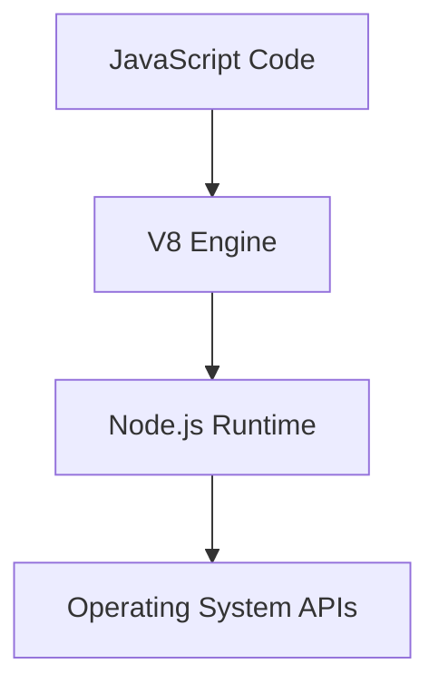
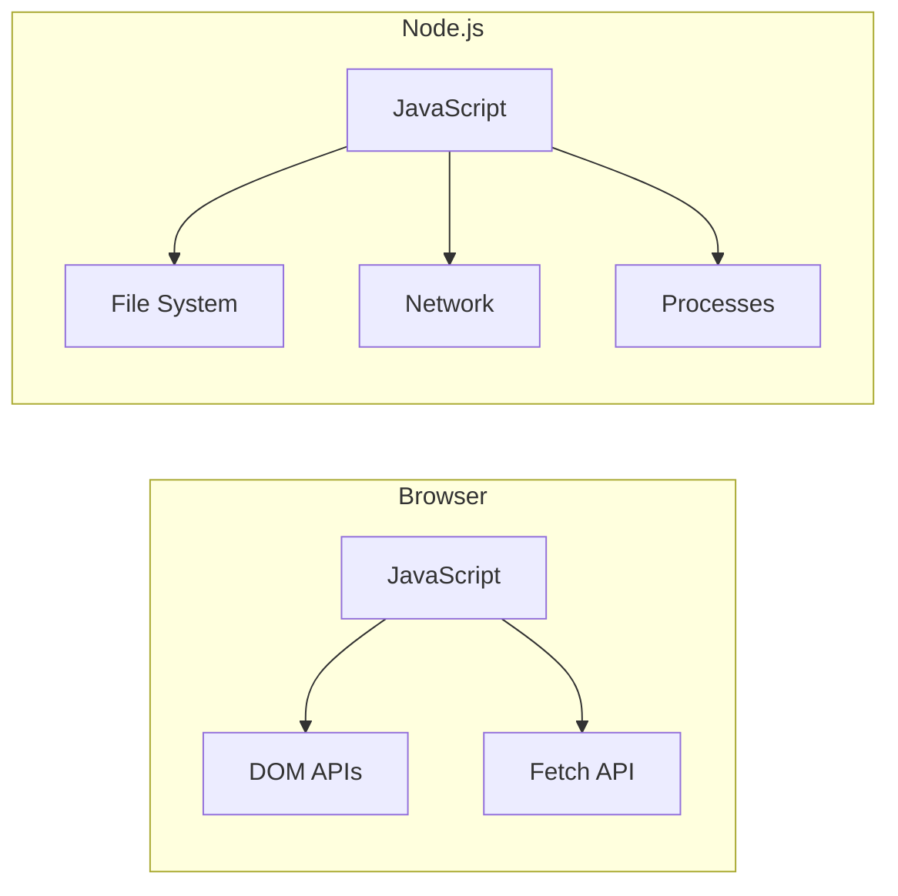
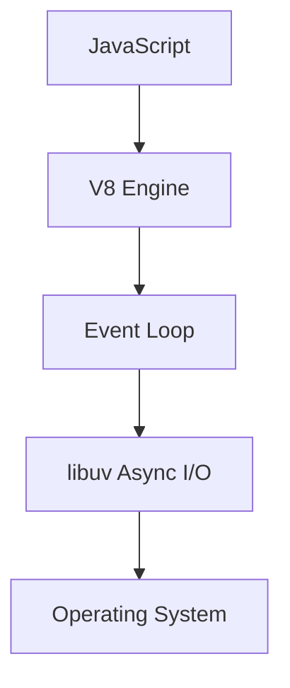
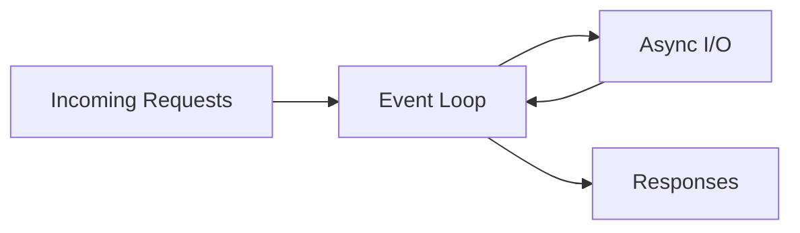
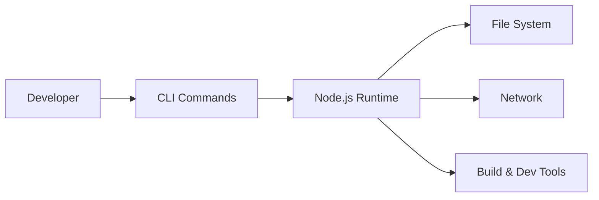
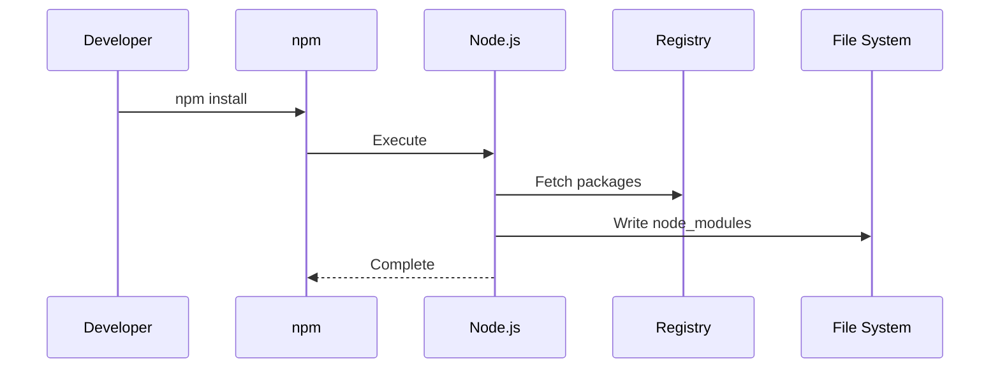
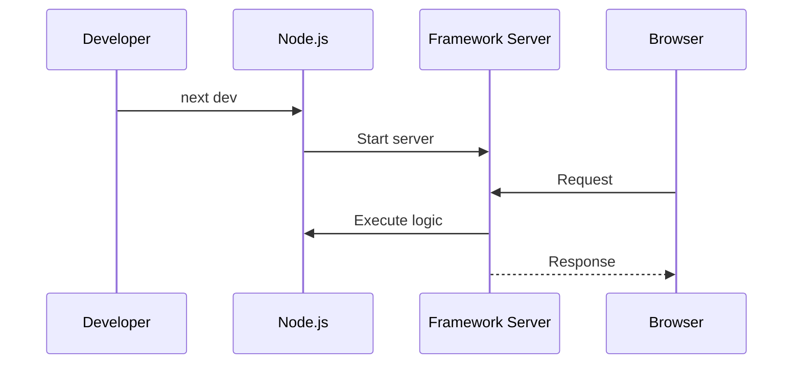

# Demystifying Node.js: Beyond the Browser (From First Principles to Real-World Architecture)

***

If you have spent any time in modern web development, you have already been using Node.js—whether you realized it or not. It powers your tooling, runs your development servers, installs your dependencies, and quietly underpins much of your daily workflow.

Yet one misconception persists: many developers still think of Node.js as a programming language.

It is not.

### Node.js Is a Runtime, Not a Language

Node.js is a JavaScript runtime environment built on Chrome’s V8 engine.

To understand that properly, separate the layers:

- JavaScript defines the language (syntax and semantics)
- V8 compiles JavaScript into machine code
- Node.js embeds V8 and exposes system-level capabilities

In the browser, V8 is paired with Web APIs like the DOM and Fetch. In Node.js, it is paired with operating system primitives like the filesystem, networking, and processes.

Same language. Completely different capabilities.

### Browser vs Node.js: Same Language, Different Power

JavaScript behaves differently depending on its host environment.

In the browser, JavaScript is sandboxed for security. It cannot touch your filesystem or spawn processes.

Node.js removes that constraint. It turns JavaScript into a system-level tool.

That shift is what transformed JavaScript from a UI scripting language into a full-stack platform.

### Node.js Is Not Neutral: It Encodes Architectural Choices

At a senior level, it is not enough to know what Node.js is—you need to understand how it wants you to build systems.

Node.js comes with strong opinions:

- Single-threaded event loop
- Non-blocking I/O model
- Asynchronous execution as the default
- Lightweight process model

This is not just an implementation detail. It is a constraint system.

If your architecture aligns with it, Node.js feels effortless. If it does not, you will constantly fight it.

### The Event Loop: Where Things Go Right (and Wrong)

The event loop is the core of Node.js’s execution model.

This model gives you:

- High throughput for I/O-heavy workloads
- Efficient handling of concurrent connections
- Minimal overhead per request

But it also comes with a sharp edge:

- Any blocking operation stalls the entire system

Examples of problematic workloads:

- Heavy JSON transformations
- CPU-intensive computations
- Image or video processing
- Cryptographic operations

Senior takeaway: Node.js is optimized for I/O-bound systems, not CPU-bound ones. If you ignore this, performance issues are not accidental—they are guaranteed.

### Why Node.js Took Over the Ecosystem

Node.js did not win purely because of backend capabilities. It won because it became the default execution layer for developer tooling.

The real shift happened when Node.js became the engine behind:

- Package management (npm, pnpm, yarn)
- Build systems (Webpack, Vite, Turbopack)
- Dev servers and CLIs
- Code transformation pipelines

When you run:

- `npm install`
- `npm run dev`
- `vite build`
- `next dev`

You are not just running scripts—you are executing Node.js programs that interact with your filesystem, network, and processes.

Here is what happens during dependency installation:

Node.js became unavoidable because it sits in the critical path of development itself.

### The Illusion of “Full-Stack JavaScript”

Node.js enabled JavaScript to span frontend and backend, but this is not inherently an architectural advantage—it is a trade-off.

Benefits:

- Shared language and tooling
- Easier onboarding and collaboration
- Type sharing with TypeScript
- Faster iteration loops

Costs:

- Over-reliance on a single ecosystem
- Blurred separation of concerns
- Increased dependency complexity
- Tendency to over-share logic between layers

Treat full-stack JavaScript as an optimization, not a principle.

### Node.js in Modern Frameworks

Frameworks like Next.js have made Node.js nearly invisible.

When you start a dev server, you are running a Node.js process that:

- Handles routing
- Executes server-side logic
- Streams responses
- Manages rendering pipelines

Node.js is no longer just “the backend.” It is the execution environment of your framework.

### Where Node.js Excels

Node.js is a strong fit when:

- You are building APIs, BFF layers, or gateways
- Your system is I/O-heavy (network, database, streaming)
- You rely heavily on JavaScript tooling
- You need fast iteration and tight frontend-backend integration

It shines as an orchestration layer.

### Where Node.js Becomes Friction

Node.js is less suitable when:

- Workloads are CPU-intensive
- You need true parallelism by default
- You require tight control over memory and performance
- Long-running compute tasks dominate execution time

Mitigations exist (worker threads, microservices, external runtimes), but they introduce additional complexity.

### The Hidden Cost: Dependency Gravity

Node.js normalized extremely large dependency graphs.

A typical project may include thousands of transitive dependencies. This leads to:

- Larger attack surface
- Slower installs and builds
- Indirect debugging complexity
- Tooling fragility

This is not inherently bad—but it is a real cost that should factor into architectural decisions.

### A Practical Mental Model

A more useful way to think about Node.js:

- Browser JavaScript = UI execution layer  
- Node.js = system and tooling execution layer  

Or more bluntly:

Node.js is infrastructure disguised as a runtime.

### The Bottom Line

Node.js did not change JavaScript—it changed where JavaScript can run and what it is allowed to do.

By bridging the gap between the language and the operating system, Node.js transformed JavaScript into a full-stack toolchain and runtime.

It excels when used for orchestration, I/O-heavy systems, and developer tooling. It struggles when forced into CPU-bound workloads or misaligned architectures.

Understanding Node.js at a deeper level means recognizing its constraints as deliberate design choices—and using them to your advantage.

The next time you:

- install dependencies  
- start a dev server  
- run a build  

remember: you are not just executing commands.

You are operating a runtime that sits between your code and your machine.

That runtime is Node.js.
