# 🕸️ Web Scraping for Absolute Beginners — From Zero to Production

> **A complete, beginner‑friendly, deeply explained, and production‑aware guide to web scraping using Python.**
>
> This guide is written to teach **how the web actually works**, how to **think like a scraper**, and how to build **robust, ethical, and scalable scraping systems**.

---

## 🎯 What Is Web Scraping (Really)?

Web scraping is **not hacking**. It is simply **automating what you already do manually in a browser**:

> Open a page → Scroll → Copy information → Paste into Excel → Repeat 1000×

Web scraping replaces that repetition with **code**.

**Mental model:**

> If your browser can see it, your program can usually fetch it.

Your browser:

* Sends a request
* Receives HTML
* Renders it visually

Your scraper:

* Sends the same request
* Receives the same HTML
* Extracts only the pieces you care about

---

## 🧠 Big Picture: How Scrapers Think

Instead of thinking in terms of "pages", scrapers think in **pipelines**:

```
URL → HTTP Request → HTML → Parsing → Extraction → Structuring → Storage
```

Let’s turn that into a system diagram:

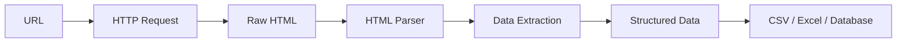

---

# 🏗 PART 1 — How the Web Actually Works

## 1. The Internet in One Diagram

When you type a URL and press Enter:

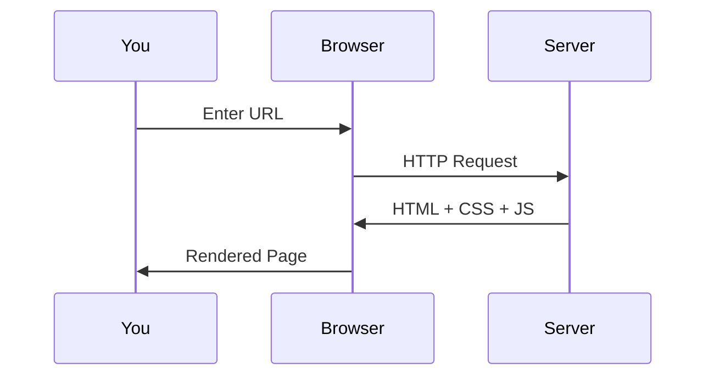

### What Your Scraper Does

Your Python script simply **replaces the browser**:

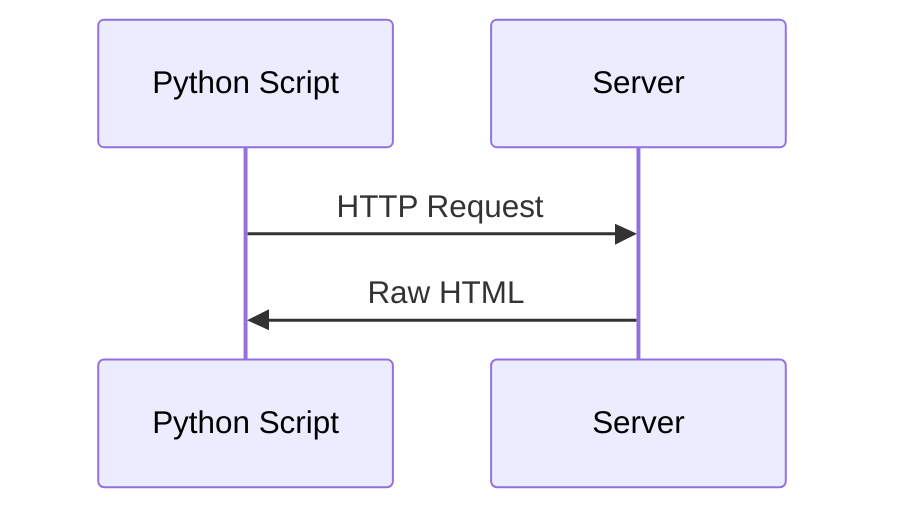

No magic. No hacking. Just automation.

---

## 2. What Is HTML (In Simple Terms)?

HTML is a **structured text document** made of nested boxes called **tags**.

Example:

```html
<article class="product">
  <h2>Wireless Mouse</h2>
  <span class="price">$19.99</span>
</article>
```

Visual mental model:

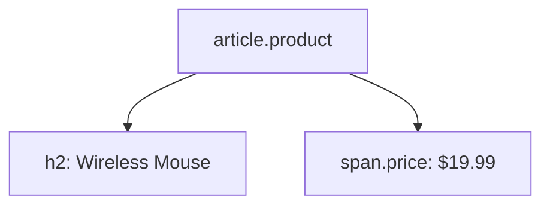

Scraping means:

> Finding the right boxes → extracting the text inside

---

# 🧰 PART 2 — Your Python Toolbelt

## Core Tools

| Tool                  | Purpose                  |
| --------------------- | ------------------------ |
| requests              | Sends HTTP requests      |
| BeautifulSoup         | Parses and searches HTML |
| pandas                | Stores & exports data    |
| Selenium / Playwright | Automates real browsers  |

Install:

```bash
pip install requests beautifulsoup4 pandas selenium
```

---

# 🏁 PART 3 — Your First Scraper (From Zero)

## Step 1: Fetch a Web Page

```python
import requests

url = "https://example.com"
response = requests.get(url)
print(response.text[:500])
```

**Mental model:**

> This is exactly what your browser does — except you see the raw text.

---

## Step 2: Parse the HTML

```python
from bs4 import BeautifulSoup

soup = BeautifulSoup(response.text, "html.parser")
print(soup.title.text)
```

Now HTML becomes a **searchable object tree**.

---

## Step 3: Extract Real Data

```python
products = soup.find_all("div", class_="product")

for p in products:
    name = p.find("h2").get_text(strip=True)
    price = p.find("span", class_="price").get_text(strip=True)
    print(name, price)
```

### Core Scraper Loop (Universal Pattern)

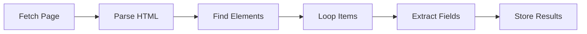

This pattern powers **almost every scraper ever written**.

---

# 📦 PART 4 — Saving Your Data (Where Scraping Becomes Useful)

Scraping without storage is useless.

## Convert Scraped Data → CSV / Excel

```python
import pandas as pd

data = {
    "Product": ["Mouse", "Keyboard"],
    "Price": [19.99, 49.99]
}

df = pd.DataFrame(data)
df.to_csv("products.csv", index=False)
```

### Data Flow Mental Model

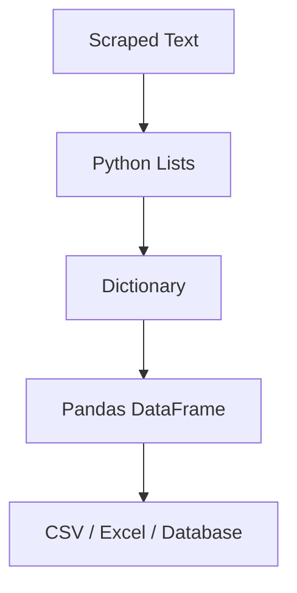

---

# 🔁 PART 5 — Pagination: Scraping Multiple Pages

Most real data lives across **many pages**.

## URL Pattern Loop

```python
for page in range(1, 6):
    url = f"https://site.com/page/{page}"
```

## Follow the “Next” Button

```python
while url:
    soup = get_soup(url)
    next_btn = soup.find("li", class_="next")
    url = next_btn.a['href'] if next_btn else None
```

### Crawler Flow Diagram

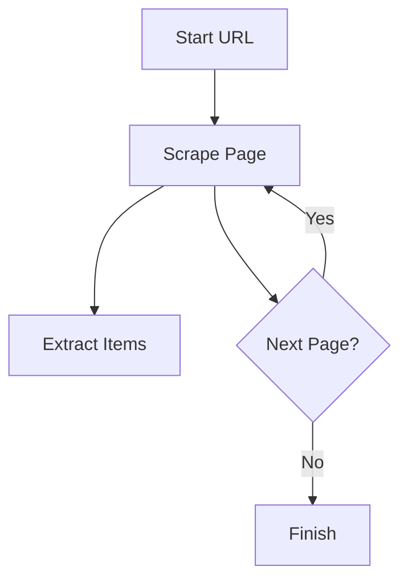

---

# 🕳 PART 6 — Deep Scraping: Opening Detail Pages

Modern sites split data:

* List page → shallow info
* Detail page → deep info

### Deep Scraping Flow

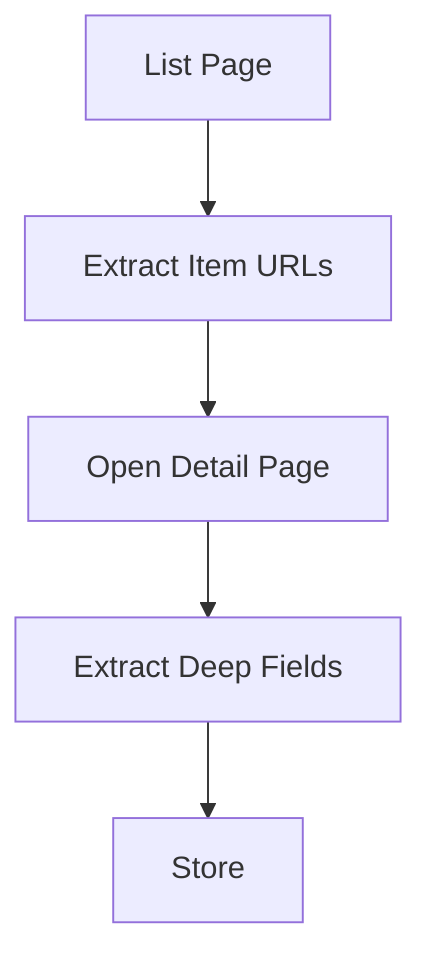

---

# ⚙ PART 7 — Static vs Dynamic Sites (Critical Concept)

## Static Sites (Easy Mode)

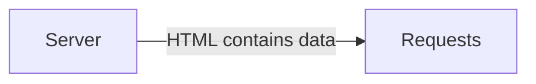

* requests + BeautifulSoup
* Fast
* Lightweight

## Dynamic Sites (Hard Mode)

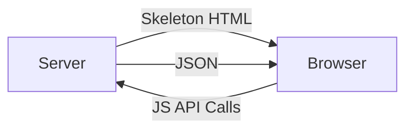

Here, data arrives **after page load via JavaScript**.

Solutions:

* Selenium / Playwright
* Hidden APIs

---

# 🤖 PART 8 — Selenium: Driving a Real Browser

```python
from selenium import webdriver
from selenium.webdriver.common.by import By

driver = webdriver.Chrome()
driver.get("https://site.com")
prices = driver.find_elements(By.CLASS_NAME, "price")
```

### Mental Model

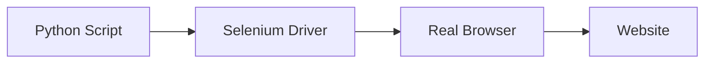
Mental Model

Selenium turns Python into a remote-control system for a real browser.

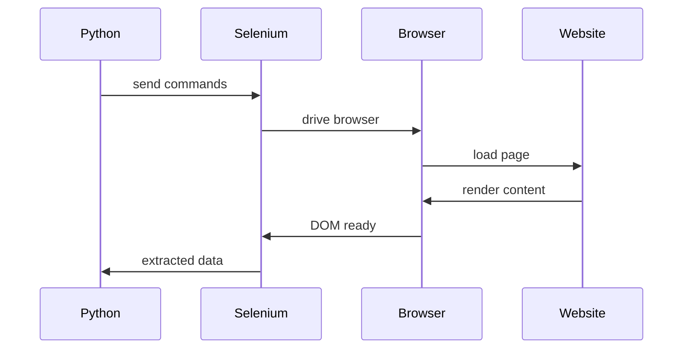

Translation:

- Python does not talk to websites directly

- Python → Selenium → Real Browser → Website

- Selenium is a browser automation bridge

---

# 🕵 PART 9 — Hidden APIs: The Pro Technique

Modern sites fetch JSON directly.

If you find those endpoints:

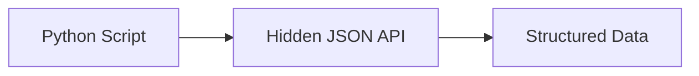

Mental Model

Instead of scraping HTML meant for humans,
you directly consume data meant for machines.

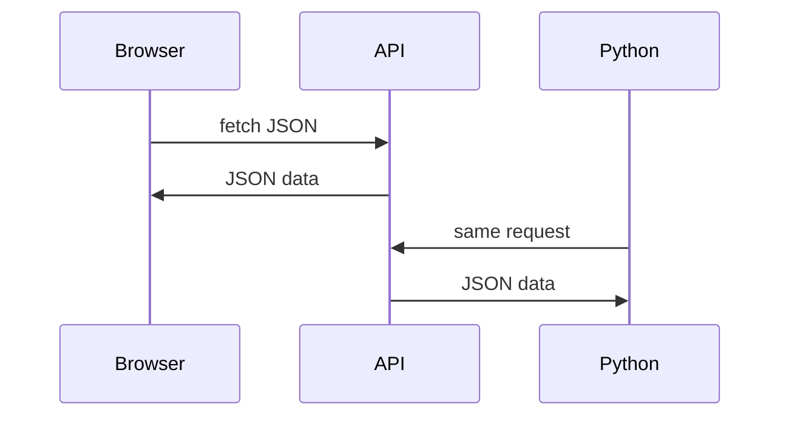

Why This Is Superior
- Method	Speed	Stability	Scalability
- Selenium	Slow	Medium	Poor
- HTML Scraping	Medium	Medium	Good
- JSON APIs	Fastest	Best	Excellent

---

# 🧠 PART 10 — Scraper Architecture (Professional Pattern)

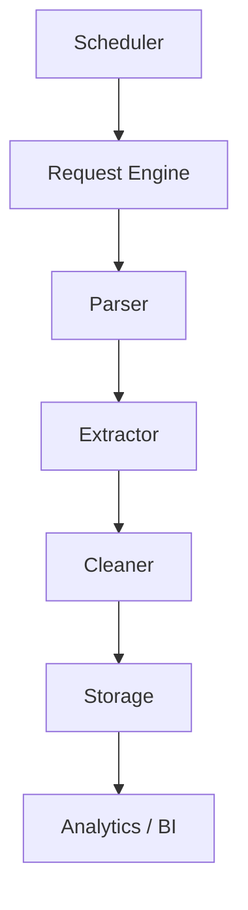

---

# 🛡 PART 11 — Ethics, Legality & Professional Conduct

Scraping power must be matched with restraint.

### Ethical Pillars

* Respect robots.txt
* Respect ToS
* Add delays
* Avoid aggressive crawling

### Politeness Delay

```python
import time
time.sleep(1)
```

---

# 🛣 PART 12 — Learning Roadmap

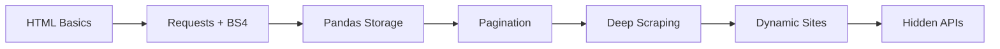

---

# 🏆 Final Mental Model: Think Like a Scraper

> A scraper is **not a bot**.
>
> It is an **automated research assistant**.

It:

* Reads pages
* Understands structure
* Extracts meaning
* Organizes knowledge

---

# 🚀 Next Steps

If you want, I can provide:

* Real‑world scraping projects
* Anti‑bot evasion strategies
* Production‑grade crawler architecture
* Distributed scraping systems
* Django + Celery + Scrapy integration patterns

