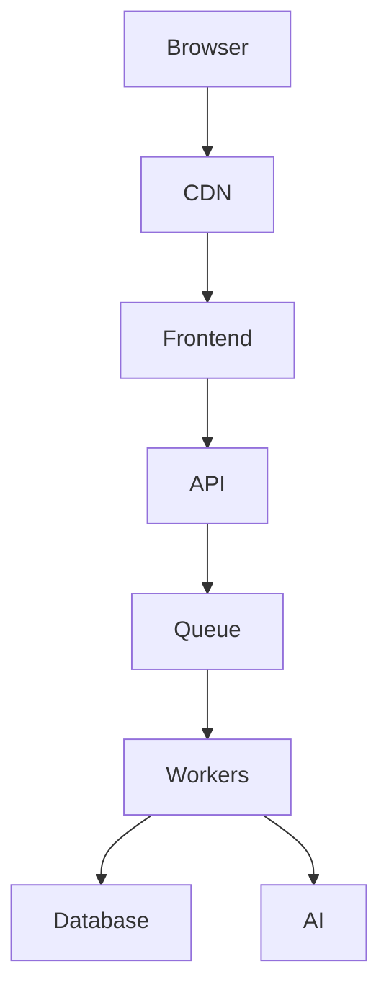

# 🚀 Enhancement Roadmap: From Portfolio Website → Professional Digital Platform

Instead of:

```
Portfolio
├── About
├── Projects
├── Blog
└── Contact
```

Build:

```
Personal Platform
├── Personal Brand
├── AI Product Showcase
├── Technical Blog
├── Learning Academy
├── Research Lab
├── Architecture Portfolio
├── Open Source
├── Speaking & Training
├── Newsletter
└── Consulting Funnel
```

---

# 1. Add a Professional Positioning Section

Most portfolios tell people:

> "Here is what I do."

Instead, tell people:

> "Why should I trust you?"

## Example Hero

```jsx
<HeroStats>
  <Metric value="20+" label="Years Architecture Experience" />
  <Metric value="$100M+" label="Programs Delivered" />
  <Metric value="100+" label="Systems Designed" />
  <Metric value="ACTA" label="Certified Trainer" />
</HeroStats>
```

Example copy:

```text
Enterprise Architect.
AI-Native Engineer.
Technical Educator.

I help organizations adopt AI-assisted software
engineering without sacrificing architecture,
governance, reliability, or engineering rigor.
```

---

# 2. Add an Architecture Portfolio Section

Most developers show code.

Architects show thinking.

```
/architecture
    /sales-order-platform
    /data-hub
    /event-platform
    /ai-agent-platform
```

Each project should include:

```
Problem
Business Context
Constraints
Architecture
Tradeoffs
ADR
Deployment
Failure Modes
Lessons Learned
```

Example:

```text
Project:
Global HR Data Hub

Scale:
150,000 employees
20 countries

Challenge:
Integrate SAP, SuccessFactors,
legacy HRIS and job portals.

Solution:
Event-driven architecture
using Kafka and microservices.

Lessons:
Distributed consistency
is mostly an organizational
problem rather than
a technical problem.
```

---

# 3. Add a "Building in Public" Section

People love watching builders.

```jsx
const nowBuilding = [
 {
   title: "Nexus LMS",
   status: "Building",
   progress: 65
 },
 {
   title: "TickerHub",
   status: "Testing",
   progress: 80
 },
 {
   title: "AI Developer Terminal",
   status: "Research",
   progress: 25
 }
]
```

Example:

```text
Currently Building

■ Nexus LMS
████████░░ 80%

■ TickerHub
███████░░░ 70%

■ AI Developer Terminal
███░░░░░░░ 30%
```

---

# 4. Add an AI Engineering Lab

Create a section dedicated to experimentation.

```
/labs
```

Examples:

| Lab        | Description                   |
| ---------- | ----------------------------- |
| RAG Lab    | Evaluate retrieval quality    |
| Agent Lab  | Multi-agent orchestration     |
| Prompt Lab | Prompt benchmarking           |
| Vision Lab | OCR and image understanding   |
| Code Lab   | AI code generation evaluation |
| Safety Lab | Hallucination testing         |

Example:

```text
AI Experiment #17

Question:
Can Claude build production
React applications?

Result:
82% success.

Failure Modes:
- Authentication
- Error handling
- Data consistency
```

---

# 5. Add a Technical Writing Hub

Instead of:

```
Blog
```

Create:

```
/writing
```

Categories:

```
Architecture
AI Engineering
Software Engineering
Cloud
Career
Teaching
System Design
Opinion
Tutorial
```

Example:

```text
Latest Essays

• Why AI Doesn't Replace Architecture
• Vibe Coding is Not Engineering
• Event Driven Systems at Scale
• React is an Execution Engine
• Building AI Native Teams
```

---

# 6. Add a Course Platform

Since you're ACTA-certified:

```
/academy
```

Examples:

```text
Courses

✓ React Development:
  Foundations to Internals

✓ Engineering in the Age of AI

✓ System Design for the AI Era

✓ Advanced JavaScript OOP

✓ AI Native Software Engineering
```

Each course:

```
Overview
Syllabus
Duration
Audience
Learning Outcomes
Labs
Projects
Certification
```

---

# 7. Add Interactive Architecture Diagrams

Use:

* Mermaid
* React Flow
* Excalidraw
* D3
* Reagraph

Example:



Interactive diagrams dramatically increase perceived expertise.

---

# 8. Add a Public Roadmap

```text
Roadmap

2026 Q2
✓ Portfolio
✓ Blog
✓ Sanity CMS

2026 Q3
□ Nexus LMS
□ TickerHub
□ AI Terminal

2026 Q4
□ SaaS Launch
□ Training Platform
□ Newsletter
```

---

# 9. Add a Research Section

```
/research
```

Examples:

```text
Research Topics

• AI Native Software Engineering
• Human + AI Pair Programming
• Agentic Development
• Software Governance
• Distributed Systems
• Developer Productivity
```

This positions you as a thought leader rather than a freelancer.

---

# 10. Add Open Source Showcase

```
/opensource
```

Each repository should include:

```text
Repository
Stars
Language
Architecture
Purpose
Status
Documentation
```

Examples:

```
Nexus LMS
TickerHub
AI Terminal
Markly
Engineering in the Age of AI
System Design for the AI Era
```

---

# 11. Add Newsletter Infrastructure

```text
The AI Engineering Architect

Weekly insights on:

✓ AI software engineering
✓ architecture
✓ distributed systems
✓ developer productivity
✓ building products
```

Stack:

```
Buttondown
ConvertKit
Beehiiv
```

---

# 12. Add Speaking & Training

```
/speaking
```

Examples:

```text
Topics

• Engineering in the Age of AI
• AI Native Development
• System Design
• React Internals
• Enterprise Architecture
• Developer Productivity
```

Include:

```
Talk title
Audience
Duration
Slides
Video
Workshop material
```

---

# 13. Add a Consulting Funnel

Instead of:

```text
Contact Me
```

Create:

```text
Work With Me
```

Services:

```
✓ Architecture Review
✓ AI Adoption Strategy
✓ System Design Consulting
✓ Technical Due Diligence
✓ Team Coaching
✓ Technical Training
```

Include:

```
Discovery Call
↓
Architecture Assessment
↓
Proposal
↓
Execution
```

---

# 14. Add Observability to Your Own Portfolio

Your portfolio itself should be engineered.

Add:

```
Analytics
Error Tracking
Tracing
Monitoring
Performance
SEO
Security
```

Tools:

* Vercel Analytics
* OpenTelemetry
* Sentry
* PostHog
* Plausible

---

# 15. Evolve the Site Architecture

Instead of:

```
Portfolio Site
```

Build:

```
seanwong.dev

├── /
├── /about
├── /projects
├── /architecture
├── /labs
├── /research
├── /writing
├── /academy
├── /speaking
├── /opensource
├── /consulting
├── /newsletter
└── /contact
```

---

# Final Recommendation

My portfolio should not look like a **developer portfolio**.

It should look like the digital headquarters of someone who is simultaneously:

* Enterprise Architect
* AI-Native Engineer
* Technical Educator
* Researcher
* Builder
* Consultant
* Founder

In other words, build a:

# 🏢 "Personal Technology Platform"

rather than a

# 📄 "Personal Portfolio Website".
